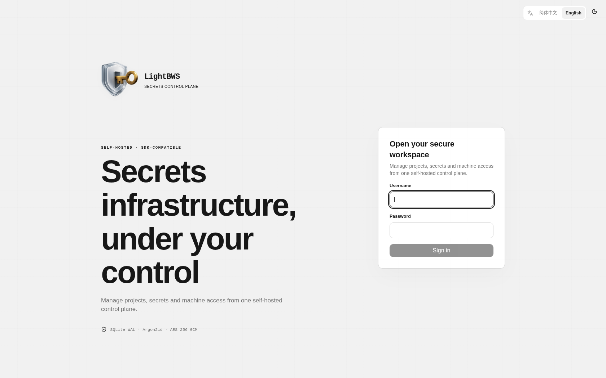
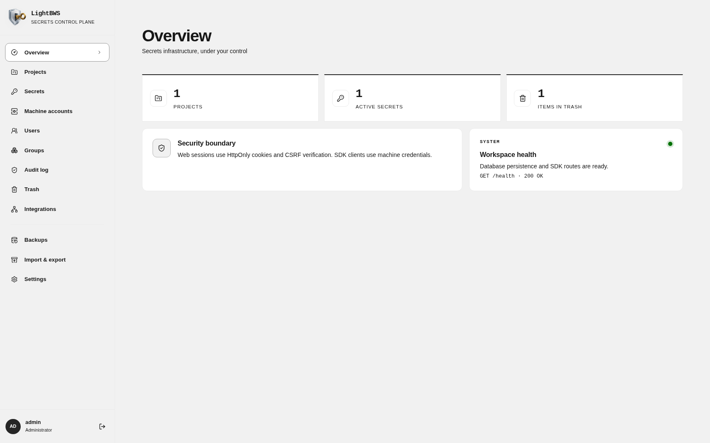
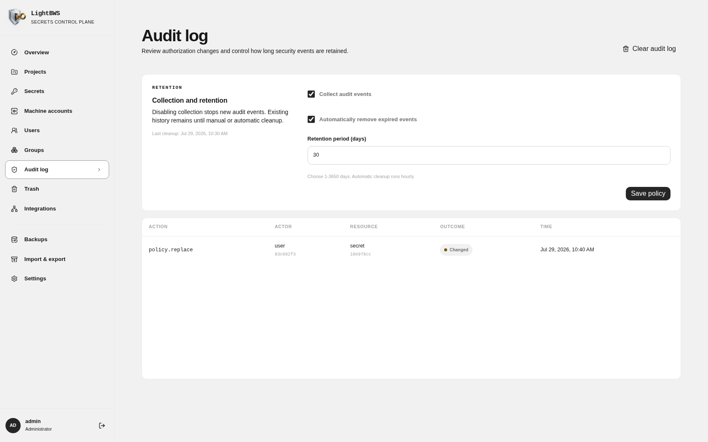

# LightBWS

LightBWS is a persistent, self-hosted Bitwarden Secrets Manager server. It combines an Axum and SeaORM backend, an embedded React/Astryx administration interface, SDK-compatible endpoints, encrypted import and export, and scheduled remote backups in one release binary.

[简体中文](README.zh-CN.md)

## Screenshots







## Features

- Persistent SQLite database with WAL, foreign keys, and safe concurrent access.
- Administrator bootstrap from environment variables, Web user management, and groups.
- Project and direct-secret grants for users, groups, and machine accounts with read or read/write access.
- Projects, secrets, machine accounts, soft-delete trash, and one-time access-token display.
- Audit collection controls with automatic retention cleanup, manual clearing, and a full off switch.
- Cookie sessions, CSRF protection, Argon2id passwords, encrypted backup credentials, and hardened response headers.
- Chinese and English UI with seven built-in Astryx themes and system, light, and dark color modes.
- Portable passphrase-encrypted import and export.
- Scheduled encrypted backups to S3-compatible storage and WebDAV.
- Frontend embedded into every release binary. No separate Web server is required.
- Linux GNU/musl, macOS, and Windows release archives plus multi-architecture GHCR and Docker Hub images.

## Quick start

### Docker

```bash
docker run --name lightbws --restart unless-stopped \
  -p 127.0.0.1:8080:8080 \
  -v lightbws-data:/data \
  -e LIGHTBWS_ADMIN_USERNAME=admin \
  -e LIGHTBWS_ADMIN_PASSWORD='replace-with-a-long-password' \
  ghcr.io/ca-x/lightbws:latest
```

Open `http://127.0.0.1:8080`. The documented Docker defaults bind only to loopback. For remote access, keep LightBWS behind an HTTPS reverse proxy and set `LIGHTBWS_COOKIE_SECURE=true`. Do not publish its HTTP port directly to an untrusted network.

The repository includes a ready-to-use `docker-compose.yml`:

```bash
cp .env.example .env
# Edit .env and set a unique LIGHTBWS_ADMIN_PASSWORD.
docker compose up -d
docker compose logs -f lightbws
```

Compose refuses to start while `LIGHTBWS_ADMIN_PASSWORD` is empty, so the public template cannot become the installed administrator password. The named volume `lightbws-data` persists the SQLite database and generated `master.key` across container upgrades.

Images are published to both `ghcr.io/ca-x/lightbws` and `docker.io/czyt/lightbws`. To use Docker Hub with Compose, set `LIGHTBWS_IMAGE=docker.io/czyt/lightbws:latest` in `.env`.

To upgrade to the newest published image:

```bash
docker compose pull
docker compose up -d
```

Set `LIGHTBWS_IMAGE=ghcr.io/ca-x/lightbws:0.1.1` in `.env` when a deployment must remain pinned to a specific release. Running `docker compose down` keeps the data volume; `docker compose down -v` permanently deletes it.

### Release binary

Download the archive for the current platform from GitHub Releases, then run:

```bash
export LIGHTBWS_DATA_DIR=./data
export LIGHTBWS_ADMIN_USERNAME=admin
export LIGHTBWS_ADMIN_PASSWORD='replace-with-a-long-password'
./lightbws
```

The administrator variables are required only when the database is empty. Existing databases are never reinitialized from environment variables.

## Configuration

The first three values in `.env.example` configure Docker Compose itself; the LightBWS process does not read them directly:

| Compose variable | Default | Purpose |
| --- | --- | --- |
| `LIGHTBWS_IMAGE` | `ghcr.io/ca-x/lightbws:latest` | Container image pulled by Compose. `docker.io/czyt/lightbws:latest` is the Docker Hub equivalent. |
| `LIGHTBWS_LISTEN_ADDRESS` | `127.0.0.1` | Host interface used for the published port. Keep loopback unless an HTTPS reverse proxy or trusted network requires another address. |
| `LIGHTBWS_PORT` | `8080` | Host port mapped to port `8080` inside the container. |

The remaining values are passed into the LightBWS container:

| Variable | Default | Purpose |
| --- | --- | --- |
| `LIGHTBWS_BIND` | `0.0.0.0:8080` | HTTP listen address. |
| `LIGHTBWS_DATA_DIR` | `data` | SQLite database and generated master-key directory. |
| `LIGHTBWS_ADMIN_USERNAME` | none | Initial administrator username. |
| `LIGHTBWS_ADMIN_PASSWORD` | none | Initial administrator password, minimum 8 characters. |
| `LIGHTBWS_COOKIE_SECURE` | `false` | Require HTTPS for Web session cookies. Enable behind an HTTPS reverse proxy. |
| `LIGHTBWS_ENABLE_UPSTREAM_COMPATIBILITY_ACCOUNT` | `false` | Create the upstream SDK test fixtures' publicly known fixed credentials. Never enable it on a shared or internet-facing deployment. |
| `LIGHTBWS_MASTER_KEY` | generated | Base64url or hexadecimal 32-byte key used to encrypt stored backup credentials. |
| `RUST_LOG` | `lightbws=info,tower_http=info` | Structured log filter. |

The image already sets `LIGHTBWS_BIND=0.0.0.0:8080` and `LIGHTBWS_DATA_DIR=/data`. Native binary deployments can override both runtime variables; Compose normally changes the host mapping through `LIGHTBWS_LISTEN_ADDRESS` and `LIGHTBWS_PORT` instead.

If `LIGHTBWS_MASTER_KEY` is not set, LightBWS creates `master.key` with owner-only permissions in the data directory. Persist this file together with the SQLite database. Remote backup files cannot be recovered without it.

## Access model

LightBWS follows the Bitwarden Secrets Manager model. It has one organization boundary and no personal secret space. Every secret belongs to exactly one project.

| Entity | Purpose | Access |
| --- | --- | --- |
| Project | Groups related secrets and provides the main permission boundary. | Users, groups, and machine accounts receive read or read/write access. |
| Machine account | Represents CI/CD, applications, and other non-human clients. | Uses a one-time access token and can receive different permissions for each project. |
| Secret | Stores one sensitive key/value pair inside a project. | Direct user, group, or machine grants can add read or read/write access to the project permission. |

Administrators manage users, groups, machine accounts, projects, and grants. Members see only the projects and secrets they can read. Write controls whether they can create, edit, move, or delete secrets. Group membership is evaluated on every request, so permission changes take effect without restarting the server or client.

## Audit log

Administrators can manage audit retention from the Web UI:

- Disable collection without deleting existing history.
- Enable hourly cleanup and choose a retention period from 1 to 3650 days.
- Clear all audit events manually after confirmation.

Audit events contain actor, action, resource identifier, outcome, and timestamp metadata. Secret values are never written to the audit log. The database blocks normal updates and deletes against audit events; cleanup opens a transaction-scoped deletion guard.

## SDK and BWS

LightBWS implements the Secrets Manager routes used by the official SDK and persists the ciphertext sent by the client. Create a machine account in the Web UI, copy its one-time credential, and point the client at the LightBWS base URL. Credential exchange issues a random one-hour bearer token whose digest is stored in SQLite. Every SDK request checks expiry and the machine account's current revocation state.

Normal deployments must use machine accounts created in the Web UI. `LIGHTBWS_ENABLE_UPSTREAM_COMPATIBILITY_ACCOUNT` exists only for upstream SDK fixtures that expect publicly known fixed client credentials. It is a test compatibility switch, not a production authentication mode.

```bash
export BWS_ACCESS_TOKEN='0.<client-id>.<client-secret>:X8vbvA0bduihIDe/qrzIQQ=='
bws --server-url https://lightbws.example.com project list
```

Release builds of the official SDK and `bws` require HTTPS. Use an HTTPS reverse proxy for deployed instances. The repository's debug SDK demo can use local HTTP for development.

An official Rust SDK round-trip demo is provided in `demo/sdk-demo`:

```bash
LIGHTBWS_URL=http://127.0.0.1:8080 \
BWS_ACCESS_TOKEN="$BWS_ACCESS_TOKEN" \
cargo run --manifest-path demo/sdk-demo/Cargo.toml
```

The acceptance demo authenticates, creates a project and secret, reads and lists them, then removes the test records. The machine account must already have read/write access to at least one project.

SDK-created values remain Bitwarden ciphertext in SQLite and are decrypted by the SDK client. Web-created values use the authenticated Web trust boundary and are intentionally not exposed through SDK ciphertext responses. The UI labels SDK-owned records accordingly.

### Fnox

Fnox uses the installed `bws` CLI for its Bitwarden Secrets Manager provider. Create a project and an SDK-owned secret in LightBWS first, then configure the project ID and secret name:

```toml
[providers]
bws = { type = "bitwarden-sm", project_id = "your-project-id" }

[secrets]
DATABASE_URL = { provider = "bws", value = "database-url" }
```

```bash
export BWS_ACCESS_TOKEN='<machine-account-access-token>'
export BWS_SERVER_URL='https://lightbws.example.com'
fnox get DATABASE_URL
fnox exec -- npm start
```

The authorization acceptance test uses the same `fnox.toml` throughout:

1. Read/write and read-only project grants both allow `fnox get DATABASE_URL`.
2. Removing the project grant takes effect on the next command and returns `secret_not_found`.
3. Restoring read access makes the same command succeed again.
4. Revoking the machine account invalidates its active SDK sessions and the next command returns HTTP 401.
5. Re-enabling the account restores access without changing the project policy or token.

## Backups and transfer

- Manual exports use an independent passphrase-derived Argon2id key and are portable between LightBWS installations.
- Scheduled S3 and WebDAV snapshots are encrypted with the persistent instance master key.
- Remote credentials are AES-256-GCM encrypted in SQLite and are never returned by the API.
- Backup endpoints must use HTTPS and resolve only to public IP addresses. Redirects are disabled to reduce SSRF risk.
- S3 uploads use AWS Signature Version 4. WebDAV uploads create required collections and then use `PUT`.
- Export snapshots are transactionally consistent and capped at 64 MiB of plaintext to bound memory use.

## Integrations

- [Official SDK](https://github.com/bitwarden/sdk-sm)
- [BWS CLI](https://github.com/bitwarden/sdk-sm/tree/main/crates/bws)
- [Fnox Bitwarden Secrets Manager provider](https://fnox.jdx.dev/providers/bitwarden-sm)
- [Bitwarden Secrets Manager help](https://bitwarden.com/help/secrets-manager-overview/)

## Development

```bash
npm --prefix web ci --ignore-scripts
npm --prefix web run dev

# In another terminal
LIGHTBWS_ADMIN_USERNAME=admin \
LIGHTBWS_ADMIN_PASSWORD=development-password \
cargo run
```

Vite proxies `/api` to `127.0.0.1:8080`. A release build requires the frontend bundle because it is embedded with `rust-embed`:

```bash
npm --prefix web run build
cargo build --release
```

The SDK acceptance demo can be checked without starting the server:

```bash
cargo check --manifest-path demo/sdk-demo/Cargo.toml
```

## Testing

The release gate runs frontend type checking, unit tests and production build; Rust formatting, Clippy, all-target tests and release build; the SDK demo compile check; workflow validation; and dependency audits:

```bash
npm --prefix web ci --ignore-scripts
npm --prefix web run typecheck
npm --prefix web run test:ci
npm --prefix web run build
cargo fmt --all --check
cargo clippy --all-targets --all-features -- -D warnings
cargo test --all-targets --all-features
cargo build --locked --release
cargo check --manifest-path demo/sdk-demo/Cargo.toml
actionlint .github/workflows/*.yml
cargo audit
npm --prefix web audit
```

Runtime acceptance additionally covers the official Rust SDK create/read/list/delete round trip, `bws` and Fnox project-scoped secret retrieval over HTTPS, administrator and member permission flows in `agent-browser`, audit cleanup controls, an empty browser console, and an Axe accessibility scan across all Astryx themes.

## Publishing

After CI succeeds on `main`, pushing a semantic `vX.Y.Z` tag starts two release workflows. The Release workflow validates every package version, reruns the complete test suite, builds all platform archives, and creates the GitHub Release. In parallel, the Docker workflow publishes the version, major-minor, `latest`, and commit-SHA tags to GHCR and Docker Hub after both architecture images succeed.

```bash
git push origin main
git tag -a v0.1.1 -m "LightBWS v0.1.1"
git push origin v0.1.1
```

The Docker workflow builds `linux/amd64` and `linux/arm64` on native GitHub runners, then publishes the same multi-platform tags to `ghcr.io/ca-x/lightbws` and `docker.io/czyt/lightbws`. Repository or organization secrets named `DOCKERHUB_USERNAME` and `DOCKERHUB_TOKEN` are required. Each release archive contains the binary, both language READMEs, and the license, with a companion SHA-256 checksum asset. Frontend files are already embedded in the binary.
