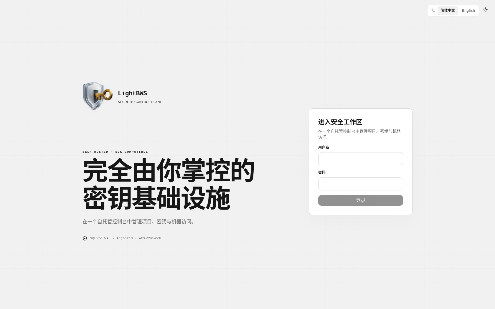
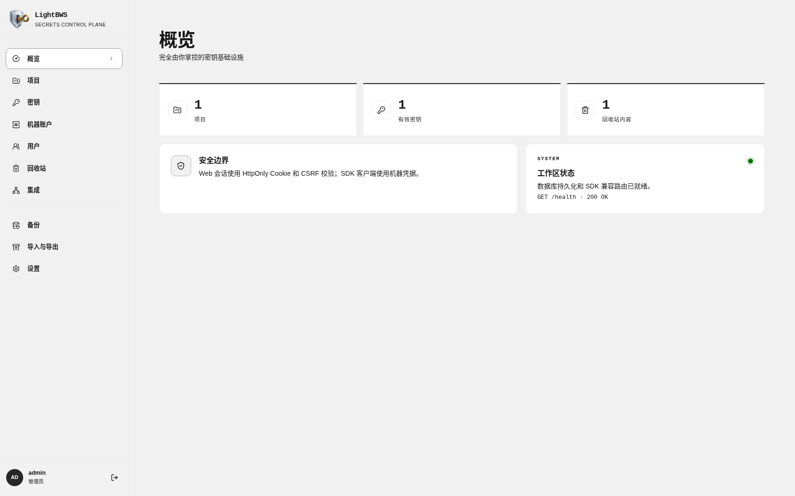
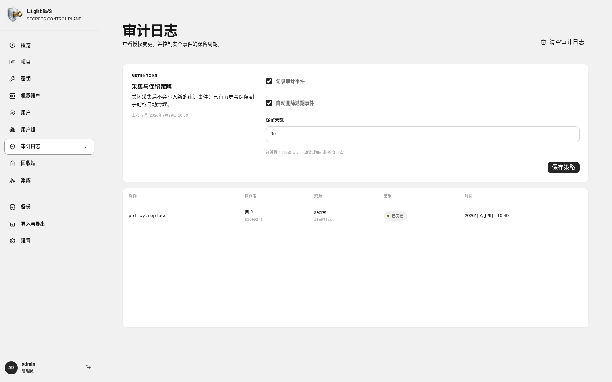
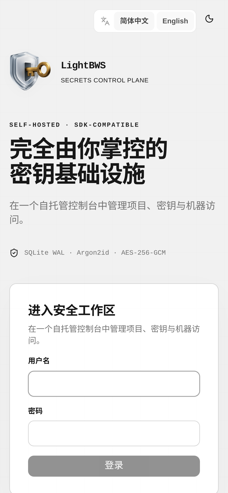
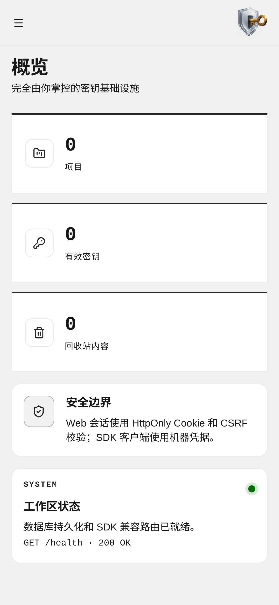

# LightBWS

LightBWS 是一个可持久化、自托管的 Bitwarden Secrets Manager server。单个发布二进制同时包含 Axum 和 SeaORM 后端、内嵌的 React/Astryx 管理界面、SDK 兼容接口、加密导入导出，以及定时远程备份。

[English](README.md)

## Secrets Manager 不是密码管理器

LightBWS 实现的是 Bitwarden Secrets Manager 工作流。Secrets Manager 和密码管理器都会保护敏感数据，但它们面向的用户、接入方式和使用场景完全不同。

| 维度 | 密码管理器 | Secrets Manager / LightBWS |
| --- | --- | --- |
| 主要用户 | 个人、家庭和办公团队 | 应用程序、机器账户、开发者、DevOps 和 CI/CD 流水线 |
| 常见数据 | 网站账号密码、个人密码、Passkey 和支付信息 | API Key、数据库凭据、服务令牌、部署密钥和基础设施配置 |
| 访问方式 | 人在解锁保险库后手动复制，或使用浏览器、移动端自动填充 | 程序通过 SDK、CLI、API 或环境变量注入读取指定密钥 |
| 集成对象 | 浏览器、桌面客户端和移动 App | 构建流水线、部署系统、容器、服务器和自动化工具 |
| 权限与审计 | 以个人保险库或共享保险库为中心 | 以项目、机器账户、团队授权、轮换流程和审计记录为中心 |

密码管理器的典型流程是：浏览器 → 打开网站 → 自动填充某个人的登录信息。Secrets Manager 的典型流程是：应用或 CI 流水线 → 使用机器账户认证 → 只读取本次任务需要的密钥 → 部署应用或连接基础设施。

LightBWS 适合为服务注入数据库连接地址、向 GitHub Actions 提供 API 令牌，或者管理 Homelab 中的部署凭据。它不能替代 Bitwarden Password Manager：LightBWS 不提供个人密码保险库、浏览器自动填充、Passkey 管理、家庭密码共享或数据泄露监控。两类产品可以配合使用。密码管理器保护“人使用的凭据”，Secrets Manager 负责把“软件需要的凭据”安全地交给程序和自动化流程。

## 界面截图







### 移动端

<p align="center">
  
  
</p>

## 功能

- 使用 SQLite 持久化数据，启用 WAL、外键和并发访问保护。
- 支持通过环境变量初始化管理员，并在 Web 界面管理用户和用户组。
- 支持为用户、用户组和机器账户配置项目权限与密钥直接权限，权限分为只读和读写。
- 支持项目、密钥、机器账户、软删除回收站和一次性访问令牌展示。
- 审计日志支持关闭记录、按保留天数自动清理和手动清空。
- 使用 Cookie 会话、CSRF 防护、Argon2id 密码、加密备份凭据和安全响应头。
- Web 界面支持中文和英文，提供 7 个 Astryx 内置主题，以及跟随系统、浅色和深色模式。
- 支持默认使用口令加密的可移植范围导入导出。
- 支持将可选范围备份写入兼容 S3 的存储和 WebDAV，默认加密，明文能力需显式开放。
- 前端已嵌入每个发布二进制，不需要单独的 Web 服务器。
- 提供 Linux GNU/musl、macOS、Windows 发布压缩包，以及多架构 GHCR 和 Docker Hub 镜像。

## 快速开始

### Docker

```bash
docker run --name lightbws --restart unless-stopped \
  -p 127.0.0.1:8080:8080 \
  -v lightbws-data:/data \
  -e LIGHTBWS_ADMIN_USERNAME=admin \
  -e LIGHTBWS_ADMIN_PASSWORD='replace-with-a-long-password' \
  ghcr.io/ca-x/lightbws:latest
```

打开 `http://127.0.0.1:8080`。文档中的 Docker 默认配置只监听本机回环地址。远程访问时，请通过 HTTPS 反向代理访问 LightBWS，并设置 `LIGHTBWS_COOKIE_SECURE=true`。不要把 HTTP 端口直接暴露到不可信网络。

仓库内提供了可直接使用的 `docker-compose.yml`：

```bash
cp .env.example .env
# 编辑 .env，设置唯一且足够长的 LIGHTBWS_ADMIN_PASSWORD。
docker compose up -d
docker compose logs -f lightbws
```

如果 `LIGHTBWS_ADMIN_PASSWORD` 为空，Compose 会拒绝启动，因此公开模板不会被用作已安装实例的管理员密码。命名卷 `lightbws-data` 会在容器升级后继续保留 SQLite 数据库和生成的 `master.key`。

镜像会同时发布到 `ghcr.io/ca-x/lightbws` 和 `docker.io/czyt/lightbws`。如需通过 Docker Hub 拉取，可在 `.env` 中设置 `LIGHTBWS_IMAGE=docker.io/czyt/lightbws:latest`。

更新到最新发布镜像：

```bash
docker compose pull
docker compose up -d
```

如果部署需要固定版本，可在 `.env` 中设置 `LIGHTBWS_IMAGE=ghcr.io/ca-x/lightbws:0.2.0`。执行 `docker compose down` 会保留数据卷，执行 `docker compose down -v` 会永久删除数据卷。

### 发布二进制

从 GitHub Releases 下载当前平台的压缩包，然后运行：

```bash
export LIGHTBWS_DATA_DIR=./data
export LIGHTBWS_ADMIN_USERNAME=admin
export LIGHTBWS_ADMIN_PASSWORD='replace-with-a-long-password'
./lightbws
```

管理员环境变量仅在数据库为空时使用。已有数据库不会再次从环境变量初始化。

## 配置

`.env.example` 的前三项只用于配置 Docker Compose，LightBWS 进程不会直接读取它们：

| Compose 变量 | 默认值 | 用途 |
| --- | --- | --- |
| `LIGHTBWS_IMAGE` | `ghcr.io/ca-x/lightbws:latest` | Compose 拉取的容器镜像。Docker Hub 对应地址为 `docker.io/czyt/lightbws:latest`。 |
| `LIGHTBWS_LISTEN_ADDRESS` | `127.0.0.1` | 发布端口绑定的宿主机地址。除非通过 HTTPS 反向代理或可信网络访问，否则应保留回环地址。 |
| `LIGHTBWS_PORT` | `8080` | 映射到容器内 `8080` 端口的宿主机端口。 |

其余变量会传入 LightBWS 容器：

| 变量 | 默认值 | 用途 |
| --- | --- | --- |
| `LIGHTBWS_BIND` | `0.0.0.0:8080` | HTTP 监听地址。 |
| `LIGHTBWS_DATA_DIR` | `data` | SQLite 数据库和生成的主密钥目录。 |
| `LIGHTBWS_ADMIN_USERNAME` | 无 | 初始管理员用户名。 |
| `LIGHTBWS_ADMIN_PASSWORD` | 无 | 初始管理员密码，至少 8 个字符。 |
| `LIGHTBWS_COOKIE_SECURE` | `false` | 要求 Web 会话 Cookie 只通过 HTTPS 传输。使用 HTTPS 反向代理时启用。 |
| `LIGHTBWS_ENABLE_UPSTREAM_COMPATIBILITY_ACCOUNT` | `false` | 创建上游 SDK 测试夹具使用的公开固定凭据，仅用于兼容性测试。不要在共享或面向互联网的部署中启用。 |
| `LIGHTBWS_MASTER_KEY` | 自动生成 | 用于加密存储备份凭据和自动备份归档的 Base64url 或十六进制 32 字节密钥。 |
| `LIGHTBWS_ALLOW_PLAINTEXT_BACKUPS` | `false` | 允许在单次导出或备份目标中显式选择明文模式，加密模式仍为默认值。 |
| `RUST_LOG` | `lightbws=info,tower_http=info` | 结构化日志过滤器。 |

镜像已经设置 `LIGHTBWS_BIND=0.0.0.0:8080` 和 `LIGHTBWS_DATA_DIR=/data`。原生二进制部署可以覆盖这两个运行时变量；Compose 部署通常应通过 `LIGHTBWS_LISTEN_ADDRESS` 和 `LIGHTBWS_PORT` 调整宿主机映射。

如果未设置 `LIGHTBWS_MASTER_KEY`，LightBWS 会使用安全随机源生成密钥，并写入数据目录下的 `master.key`。在 Unix 系统上，该文件权限为仅所有者可读写（`0600`）。建议使用这种默认方式，并将该文件与 SQLite 数据库一起持久化。

如果需要手动设置 `LIGHTBWS_MASTER_KEY`，密钥必须是随机生成的 32 字节（256 bit）数据，不能使用任意 32 字符字符串。LightBWS 支持 64 个十六进制字符，或者不带填充的 Base64url 编码。32 字节密钥编码为 Base64url 后通常是 43 个字符。推荐使用更简单的十六进制格式：

```bash
openssl rand -hex 32
```

如需生成不带填充的 Base64url 格式：

```bash
openssl rand -base64 32 | tr '+/' '-_' | tr -d '=\n'
```

请妥善保管并单独备份主密钥。不要在未重新加密受保护数据的情况下轮换或替换它。密钥一旦丢失或改变，已有的备份凭据和加密备份文件将无法恢复。

## 权限模型

LightBWS 按照 Bitwarden Secrets Manager 的模型实现权限系统。系统只有一个组织边界，不存在个人密钥空间，每个密钥必须且只能属于一个项目。

| 实体 | 用途 | 权限方式 |
| --- | --- | --- |
| 项目 | 对相关密钥进行分组，也是主要权限边界。 | 用户、用户组和机器账户可以获得只读或读写权限。 |
| 机器账户 | 代表 CI/CD、应用和其他非人工客户端。 | 使用一次性访问令牌认证，每个项目可以配置不同权限。 |
| 密钥 | 保存项目中的一个敏感键值对。 | 可以直接为用户、用户组或机器账户增加只读或读写权限，并与项目权限叠加。 |

管理员负责管理用户、用户组、机器账户、项目和授权。普通成员只能看到自己可读取的项目与密钥。读写权限决定用户能否创建、编辑、移动或删除密钥。系统会在每次请求时计算用户组继承关系，因此修改权限后无需重启服务或客户端。

## 审计日志

管理员可以在 Web 界面配置审计日志的生命周期：

- 关闭记录时停止写入新事件，已有历史不会被删除。
- 开启自动清理后，每小时检查一次，可设置 1 至 3650 天的保留期。
- 确认后可手动清空全部审计事件。

审计事件只保存操作者、操作、资源标识、结果和时间，不会记录密钥值。数据库禁止普通代码修改或删除审计事件，清理操作只能在受控事务中临时打开删除闸门。

## SDK 和 BWS

LightBWS 实现官方 SDK 使用的 Secrets Manager 路由，并持久化客户端发送的密文。请在 Web 界面创建机器账号，复制一次性凭据，然后将客户端指向 LightBWS 基础地址。凭据交换会签发随机的一小时 Bearer 令牌，并将摘要写入 SQLite。每次 SDK 请求都会检查令牌是否过期，以及机器账号是否仍处于有效状态。

正常部署应使用 Web 界面创建的机器账号。`LIGHTBWS_ENABLE_UPSTREAM_COMPATIBILITY_ACCOUNT` 只用于运行依赖公开固定客户端凭据的上游 SDK 测试夹具。它是测试兼容开关，不是生产认证模式。

```bash
export BWS_ACCESS_TOKEN='0.<client-id>.<client-secret>:X8vbvA0bduihIDe/qrzIQQ=='
bws --server-url https://lightbws.example.com project list
```

官方 SDK 和 `bws` 的发布构建强制使用 HTTPS。部署时请通过 HTTPS 反向代理访问 LightBWS。仓库中的调试版 SDK 演示可在本地开发时使用 HTTP。

仓库在 `demo/sdk-demo` 提供官方 Rust SDK 往返演示：

```bash
LIGHTBWS_URL=http://127.0.0.1:8080 \
BWS_ACCESS_TOKEN="$BWS_ACCESS_TOKEN" \
cargo run --manifest-path demo/sdk-demo/Cargo.toml
```

演示会完成认证，创建项目和密钥，读取并列出它们，然后删除测试数据。运行前需要先为机器账户授予至少一个项目的读写权限。

SDK 创建的数据会以 Bitwarden 密文保存在 SQLite 中，并由 SDK 客户端解密。Web 创建的数据属于经过认证的 Web 信任边界，不会伪装成 SDK 密文响应。界面会明确标记 SDK 数据。

### Fnox

Fnox 的 Bitwarden Secrets Manager provider 会调用本机安装的 `bws` CLI。请先在 LightBWS 中创建项目和 SDK 密钥，再配置项目 ID 与密钥名称：

```toml
[providers]
bws = { type = "bitwarden-sm", project_id = "your-project-id" }

[secrets]
DATABASE_URL = { provider = "bws", value = "database-url" }
```

```bash
export BWS_ACCESS_TOKEN='<机器账号访问令牌>'
export BWS_SERVER_URL='https://lightbws.example.com'
fnox get DATABASE_URL
fnox exec -- npm start
```

授权验收始终使用同一份 `fnox.toml`：

1. 项目权限为读写或只读时，`fnox get DATABASE_URL` 都能读取密钥。
2. 移除项目授权后，下一次执行立即返回 `secret_not_found`。
3. 恢复只读权限后，同一条命令无需修改配置即可重新成功。
4. 吊销机器账户会同时使已有 SDK 会话失效，下一次执行立即返回 HTTP 401。
5. 重新启用机器账户后，不需要修改项目权限或访问令牌即可恢复访问。

## 备份和迁移

- 默认备份范围只包含项目和密钥。可选范围包括用户、用户组及成员关系、机器账户、授权策略、审计设置和记录，以及备份目标配置和凭据。“完整实例”预设包含全部持久化范围，可以重建持久化数据库。
- 会话、机器会话、备份任务历史、迁移元数据、SQLite WAL 状态和 `master.key` 永远不会写入归档。
- 手动加密导出使用独立的口令派生 Argon2id 密钥，可在不同 LightBWS 实例之间迁移；导入时使用同一口令。
- S3 和 WebDAV 定时快照使用持久化的实例主密钥加密。要在其他实例恢复，请提供来源实例的旧 `master.key`；它只用于解密所选归档，不会替换目标实例的密钥。
- `.lightbws` 归档永远不会包含或同时上传 `master.key`，请单独备份。归档内的备份目标凭据在导入后会使用目标实例的主密钥重新加密。
- 导入的备份目标始终处于停用状态，定时任务也会关闭。请逐一检查并测试目标地址，再显式启用。如果目标实例未开放明文能力，导入的明文目标会转换为主密钥加密。
- 默认禁止明文归档。只有设置 `LIGHTBWS_ALLOW_PLAINTEXT_BACKUPS=true` 后，界面才允许为单次导出或单个备份目标显式选择明文；已有和新建目标仍默认加密。明文文件使用 `.plain.lightbws` 后缀，界面会要求二次确认。
- 明文归档导入时不需要口令或 `master.key`。如果包含完整实例范围，同样可以重建持久化数据库，但任何能读取该文件的人都能直接读取其中的密钥和凭据。
- 远程凭据使用 AES-256-GCM 加密保存在 SQLite 中，API 永远不会返回这些凭据。
- 备份地址必须使用 HTTPS，并且只能解析到公网 IP。程序禁用重定向以降低 SSRF 风险。
- S3 上传使用 AWS Signature Version 4。WebDAV 上传会先创建所需目录，再使用 `PUT` 上传。
- 导出快照在事务中保持一致，明文大小限制为 64 MiB，以控制内存占用。

## 集成

- [官方 SDK](https://github.com/bitwarden/sdk-sm)
- [BWS CLI](https://github.com/bitwarden/sdk-sm/tree/main/crates/bws)
- [Fnox Bitwarden Secrets Manager provider](https://fnox.jdx.dev/providers/bitwarden-sm)
- [Bitwarden Secrets Manager 帮助文档](https://bitwarden.com/help/secrets-manager-overview/)

## 开发

```bash
npm --prefix web ci --ignore-scripts
npm --prefix web run dev

# 在另一个终端执行
LIGHTBWS_ADMIN_USERNAME=admin \
LIGHTBWS_ADMIN_PASSWORD=development-password \
cargo run
```

Vite 会将 `/api` 代理到 `127.0.0.1:8080`。发布构建需要前端包，因为它通过 `rust-embed` 嵌入二进制：

```bash
npm --prefix web run build
cargo build --release
```

无需启动服务器即可检查 SDK 演示：

```bash
cargo check --manifest-path demo/sdk-demo/Cargo.toml
```

## 测试

发布门禁会执行前端类型检查、单元测试和生产构建，Rust 格式检查、Clippy、全目标测试和 release 构建，SDK 演示编译检查，工作流验证，以及依赖安全审计：

```bash
npm --prefix web ci --ignore-scripts
npm --prefix web run typecheck
npm --prefix web run test:ci
npm --prefix web run build
cargo fmt --all --check
cargo clippy --all-targets --all-features -- -D warnings
cargo test --all-targets --all-features
cargo build --locked --release
cargo check --manifest-path demo/sdk-demo/Cargo.toml
actionlint .github/workflows/*.yml
cargo audit
npm --prefix web audit
```

运行时验收还会覆盖官方 Rust SDK 的创建、读取、列表和删除往返流程，`bws` 与 Fnox 通过 HTTPS 按项目读取密钥，使用 `agent-browser` 检查管理员与普通成员权限、审计清理、浏览器控制台，以及全部 Astryx 主题下的 Axe 无障碍扫描。

## 发布

`main` 通过 CI 后，推送 `vX.Y.Z` 语义化标签会启动两个发布工作流。Release 工作流会校验所有包版本、重新运行完整测试套件、构建各平台归档并创建 GitHub Release；Docker 工作流则并行构建两个架构的镜像，全部成功后将版本号、主次版本、`latest` 和提交 SHA 标签发布到 GHCR 与 Docker Hub。

```bash
git push origin main
git tag -a v0.2.0 -m "LightBWS v0.2.0"
git push origin v0.2.0
```

Docker 工作流会在 GitHub 原生 Runner 上分别构建 `linux/amd64` 和 `linux/arm64`，再将相同的多架构标签发布到 `ghcr.io/ca-x/lightbws` 和 `docker.io/czyt/lightbws`。仓库或组织需要提供 `DOCKERHUB_USERNAME` 和 `DOCKERHUB_TOKEN` 两个 secret。每个发布压缩包包含二进制、两种语言的 README 和许可证，并提供独立的 SHA-256 校验文件。前端文件已经嵌入二进制。
